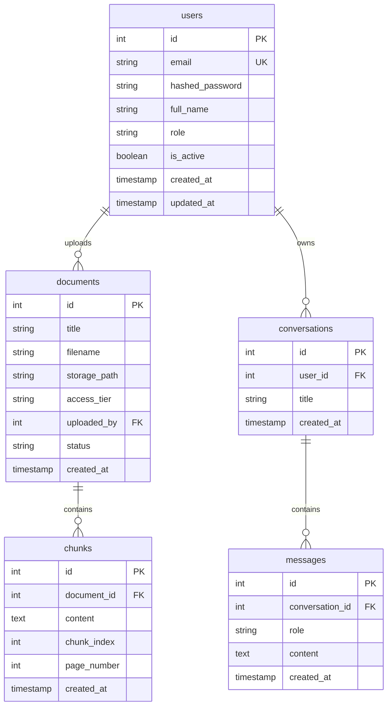
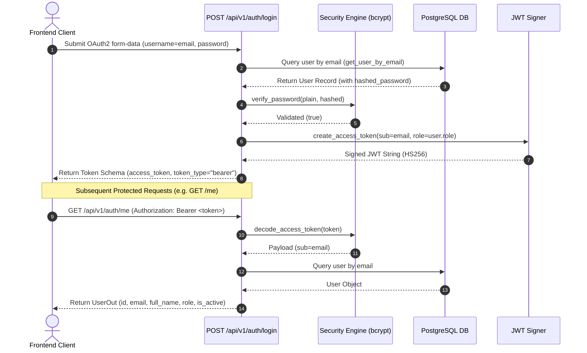

# HITRAG End-to-End System Architecture & Design Rationale

## 1. Executive Summary

**HITRAG** (Harare Institute of Technology RAG Assistant) is an institutional AI knowledge assistant designed for students, lecturers, and administrators at the Harare Institute of Technology. All responses generated by HITRAG are strictly grounded in official HIT documents, regulations, and handbooks, with mandatory citation tracking for every generated claim.

This document details the architectural decisions, design choices, database schema, component patterns, authentication model, and rationale across both the **Frontend (Next.js)** and **Backend (FastAPI + PostgreSQL + SQLAlchemy)** services.

---

## 2. System Overview & Technology Stack

```
                           +-------------------------------------+
                           |         Next.js 14 Frontend         |
                           |   (App Router, Tailwind, TS)       |
                           +------------------+------------------+
                                              |
                                              | HTTP / JSON API (Bearer JWT)
                                              v
                           +-------------------------------------+
                           |          FastAPI Backend            |
                           |     (Python 3.11+, Uvicorn)         |
                           +------------------+------------------+
                                              |
                                              | SQLAlchemy 2.0 ORM
                                              v
                           +-------------------------------------+
                           |         PostgreSQL Database         |
                           |       (Alembic Migrations)          |
                           +-------------------------------------+
```

### Stack Choices & Engineering Rationale

| Layer | Chosen Technology | Why We Chose It |
| :--- | :--- | :--- |
| **Frontend Framework** | Next.js 14 (App Router) | Server-side rendering (SSR), fast dynamic routing, seamless React server components, and component-level code splitting out of the box. |
| **Frontend Styling** | Tailwind CSS (Custom Tokens) | Zero-runtime CSS utility engine allowing strict institutional design token enforcement (`hit.*` palette namespace) without bloated CSS-in-JS runtimes. |
| **Backend Framework** | FastAPI (Python 3.11+) | Asynchronous execution, automatic OpenAPI schema generation, fast Pydantic data validation, and native integration with Python ML/RAG libraries. |
| **Database Engine** | PostgreSQL | Enterprise relational consistency, strict foreign key constraints, JSON support, and future compatibility with `pgvector` for vector similarity search. |
| **ORM / Migration** | SQLAlchemy 2.0 + Alembic | Type-safe declarative Python models, explicit connection pooling (`pool_pre_ping`), and reproducible autogenerated database migration scripts. |
| **Config Engine** | `pydantic-settings` | Type-safe environment variable parsing (`DATABASE_URL`, `SECRET_KEY`, `DEBUG`, `PORT`) with automatic validation and `.env` parsing. |
| **Password Hashing** | `passlib[bcrypt]` (`bcrypt<4.0.0`) | Industry-standard salted password hashing algorithm (`bcrypt`), preventing plain-text credential leaks or rainbow table attacks. |
| **Token Signing** | `python-jose[cryptography]` | Compact, cryptographically signed JSON Web Tokens (`HS256` symmetric signing) for stateless Bearer authentication. |

---

## 3. Backend Architecture & Database Models

### Core Database Schema (`backend/app/models/`)

The database schema models users, documents, text chunks, conversations, and chat messages:



### Architectural Decisions — Database & Models

1. **Role-Based Access Control via Python Enums (`UserRole`)**:
   - *Decision*: We used native Python string Enums (`PUBLIC`, `STUDENT`, `LECTURER`, `ADMIN`) mapped directly to SQL Enum columns.
   - *Rationale*: Avoids redundant database JOIN operations for static role definitions while keeping queries type-safe.

2. **Foreign Key CASCADE Deletes (`ondelete="CASCADE"`)**:
   - *Decision*: Configured explicit `CASCADE` rules on `Document.chunks`, `User.documents`, `User.conversations`, and `Conversation.messages`.
   - *Rationale*: Ensures strict data integrity. Deleting a document automatically cleans up all associated chunks; deleting a user removes their private session histories without leaving orphaned records.

3. **Decoupled Text Chunking (`Chunk` Model)**:
   - *Decision*: Split document text into indexed chunks (`chunk_index`, `page_number`).
   - *Rationale*: RAG systems cannot pass whole 100-page PDFs to LLMs. Splitting documents into searchable chunks allows retrieving exact page-numbered paragraphs.

4. **Dynamic DB Settings & Health Check Diagnostics**:
   - *Decision*: `GET /health` executes a live `SELECT 1` query via `get_db()` dependency.
   - *Rationale*: Guarantees the server returns `503 Service Unavailable` with structured JSON if the database is unreachable, rather than hanging or emitting raw unhandled stack traces.

---

## 4. Authentication Architecture & Security Decisions (Phase 4)

### Authentication Flow Architecture



### Architectural Decisions — Authentication & Security

1. **Decoupled Registration vs. Login Endpoints**:
   - *Decision*: `POST /api/v1/auth/register` creates user accounts and returns a sanitized `UserOut` schema, intentionally omitting the access token. Users must execute an explicit `POST /api/v1/auth/login` request.
   - *Rationale*: Aligns with OAuth2 standard conventions, enforces credential verification before issuing session tokens, and prevents accidental token leakage in account provision logs.

2. **Stateless JWT Tokens vs. Server-Side Sessions**:
   - *Decision*: Signed Bearer JWTs (`HS256`) containing `sub` (user email), `role`, and expiration claims (`exp`).
   - *Rationale*: Eliminates server-side session DB lookups on every API call, enabling horizontally scalable stateless microservices.
   - *Tradeoff Note*: `POST /api/v1/auth/logout` is a client-side token discard operation. Server-side token revocation blocklists (e.g. Redis-backed JWT blacklisting) can be added in future phases if instant token revocation is required.

3. **Dependency Injection Security (`get_current_user`)**:
   - *Decision*: Protected endpoints inject `get_current_user` (`app/core/deps.py`), which uses FastAPI's `OAuth2PasswordBearer` scheme to decode tokens, fetch the user, and verify active status (`is_active`).
   - *Rationale*: Centralizes security validation into a single reusable dependency, raising structured `401 Unauthorized` responses on missing, expired, or tampered tokens.

4. **Sanitized User Schema Output (`UserOut`)**:
   - *Decision*: All auth endpoints return `UserOut` (`id`, `email`, `full_name`, `role`, `is_active`, `created_at`). `hashed_password` is strictly excluded.
   - *Rationale*: Prevents internal password hash leakage across JSON API responses.

---

## 5. Frontend Architecture & Design System

### Design System Palette (`hit.*` namespace)

Custom tokens configured in `frontend/tailwind.config.ts`:

| Token | Hex | Rationale & Usage |
| :--- | :--- | :--- |
| `hit.blue` | `#0B2E5C` | Institutional Primary Brand Color — used for headers, primary buttons, and navbar. |
| `hit.blue-dark` | `#071D3D` | Dark Accent Surface — used for sidebar background and container contrasts. |
| `hit.amber` | `#E8A33D` | Grounded Accent & Citation Highlight — represents innovation and verified grounding. |
| `hit.bg` | `#F7F8FA` | Application Canvas Background — clean, neutral off-white reading surface. |
| `hit.surface` | `#FFFFFF` | Card & Slide-in Panel Surfaces — high-contrast white card container background. |
| `hit.border` | `#DDE3EA` | Border & Structural Neutral Lines — subtle divider lines between panels. |
| `hit.text-primary`| `#16202B` | Primary Typography — high contrast, readable dark slate text. |
| `hit.text-secondary`| `#5B6B7A` | Secondary Typography — muted slate text for timestamps and metadata rows. |
| `hit.success` | `#2F7D5E` | Grounded Verification Badge — indicates verified document status. |
| `hit.warning` | `#B5482D` | Muted Red Access Boundary — indicates restricted tier boundaries neutrally. |

---

### Key UI Component Patterns

1. **Footnote Citation Drawer (`components/chat/citation-drawer.tsx`)**:
   - *Desktop*: Slide-in panel (`w-96 h-full border-l`) that opens alongside the chat feed without hiding the conversation context.
   - *Mobile*: Bottom sheet drawer (`max-h-[85vh] rounded-t-2xl`) with backdrop blur overlay.
   - *Design*: Styled like a document footnote with an amber left-edge quote border (`border-l-4 border-l-hit-amber`).

2. **Restricted Boundary Notice (`components/ui/restricted-boundary-notice.tsx`)**:
   - *Design*: Uses a muted red `#B5482D` left-edge grounding line (`GroundingRule`).
   - *Tone*: Neutral, calm institutional boundary (*"This query pertains to institutional records outside the access permissions of student accounts."*) with a recommended contact office card.
   - *Security Guarantee*: Zero document title or content leakage for unauthorized access levels.

3. **Active Scope Transparency Indicator (`components/chat/chat-input.tsx`)**:
   - Displays session permissions (`Active Retrieval Scope: Public + Student`) near the input bar so users know their active document scope without adding settings clutter.

4. **Service Abstraction Layer (`frontend/lib/api.ts`)**:
   - Decouples UI components from raw data mocks via async helper methods (`getConversations()`, `sendMessage()`, `getCurrentUserRole()`).
   - *Rationale*: Allows swapping mock data for real FastAPI endpoints in future phases with zero component rewrites.

---

## 6. Verification & Testing

Both frontend and backend services include automated verification suites:

- **Backend Pytest Suite** (`backend/tests/`):
  - `test_health.py`: Validates `GET /health` DB connectivity logic and error handling.
  - `test_models.py`: Validates model creation, relationship querying, and cascade deletion.
  - `test_auth.py`: Validates user registration, OAuth2 password authentication, JWT token issuance, and protected `/me` endpoints.
  - `scripts/seed_check.py`: Smoke test inserting and reading models.
- **Frontend Build Verification**:
  - `npm run build`: Compiles static pages, dynamic chunk traces, and TypeScript definitions cleanly.
