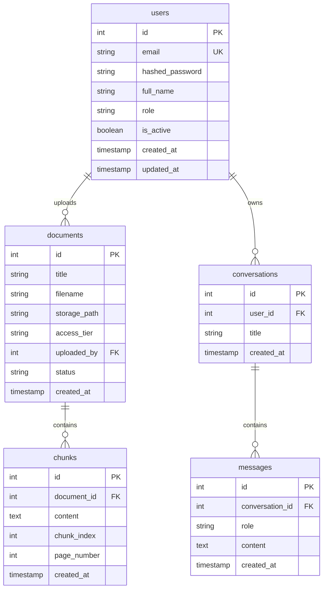
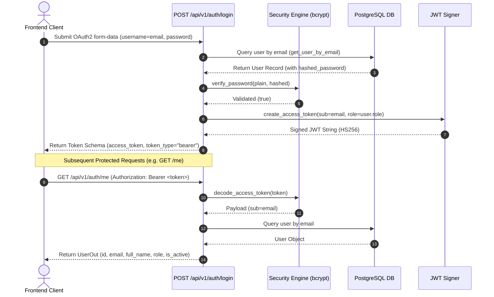

# HITRAG End-to-End System Architecture & Design Rationale

## 1. Executive Summary

**HITRAG** (Harare Institute of Technology RAG Assistant) is an institutional AI knowledge assistant designed for students, lecturers, and administrators at the Harare Institute of Technology. All responses generated by HITRAG are strictly grounded in official HIT documents, regulations, and handbooks, with mandatory citation tracking for every generated claim.

This document details the architectural decisions, design choices, database schema, component patterns, authentication model, and rationale across both the **Frontend (Next.js)** and **Backend (FastAPI + PostgreSQL + SQLAlchemy)** services.

---

## 2. System Overview & Technology Stack

```
                           +-------------------------------------+
                           |         Next.js 14 Frontend         |
                           |   (App Router, Tailwind, TS)       |
                           +------------------+------------------+
                                              |
                                              | HTTP / JSON API (Bearer JWT)
                                              v
                           +-------------------------------------+
                           |          FastAPI Backend            |
                           |     (Python 3.11+, Uvicorn)         |
                           +------------------+------------------+
                                              |
                                              | SQLAlchemy 2.0 ORM
                                              v
                           +-------------------------------------+
                           |         PostgreSQL Database         |
                           |       (Alembic Migrations)          |
                           +-------------------------------------+
```

### Stack Choices & Engineering Rationale

| Layer | Chosen Technology | Why We Chose It |
| :--- | :--- | :--- |
| **Frontend Framework** | Next.js 14 (App Router) | Server-side rendering (SSR), fast dynamic routing, seamless React server components, and component-level code splitting out of the box. |
| **Frontend Styling** | Tailwind CSS (Custom Tokens) | Zero-runtime CSS utility engine allowing strict institutional design token enforcement (`hit.*` palette namespace) without bloated CSS-in-JS runtimes. |
| **Backend Framework** | FastAPI (Python 3.11+) | Asynchronous execution, automatic OpenAPI schema generation, fast Pydantic data validation, and native integration with Python ML/RAG libraries. |
| **Database Engine** | PostgreSQL | Enterprise relational consistency, strict foreign key constraints, JSON support, and future compatibility with `pgvector` for vector similarity search. |
| **ORM / Migration** | SQLAlchemy 2.0 + Alembic | Type-safe declarative Python models, explicit connection pooling (`pool_pre_ping`), and reproducible autogenerated database migration scripts. |
| **Config Engine** | `pydantic-settings` | Type-safe environment variable parsing (`DATABASE_URL`, `SECRET_KEY`, `DEBUG`, `PORT`) with automatic validation and `.env` parsing. |
| **Password Hashing** | `passlib[bcrypt]` (`bcrypt<4.0.0`) | Industry-standard salted password hashing algorithm (`bcrypt`), preventing plain-text credential leaks or rainbow table attacks. |
| **Token Signing** | `python-jose[cryptography]` | Compact, cryptographically signed JSON Web Tokens (`HS256` symmetric signing) for stateless Bearer authentication. |

---

## 3. Backend Architecture & Database Models

### Core Database Schema (`backend/app/models/`)

The database schema models users, documents, text chunks, conversations, and chat messages:



### Architectural Decisions — Database & Models

1. **Role-Based Access Control via Python Enums (`UserRole`)**:
   - *Decision*: We used native Python string Enums (`PUBLIC`, `STUDENT`, `LECTURER`, `ADMIN`) mapped directly to SQL Enum columns.
   - *Rationale*: Avoids redundant database JOIN operations for static role definitions while keeping queries type-safe.

2. **Foreign Key CASCADE Deletes (`ondelete="CASCADE"`)**:
   - *Decision*: Configured explicit `CASCADE` rules on `Document.chunks`, `User.documents`, `User.conversations`, and `Conversation.messages`.
   - *Rationale*: Ensures strict data integrity. Deleting a document automatically cleans up all associated chunks; deleting a user removes their private session histories without leaving orphaned records.

3. **Decoupled Text Chunking (`Chunk` Model)**:
   - *Decision*: Split document text into indexed chunks (`chunk_index`, `page_number`).
   - *Rationale*: RAG systems cannot pass whole 100-page PDFs to LLMs. Splitting documents into searchable chunks allows retrieving exact page-numbered paragraphs.

4. **Dynamic DB Settings & Health Check Diagnostics**:
   - *Decision*: `GET /health` executes a live `SELECT 1` query via `get_db()` dependency.
   - *Rationale*: Guarantees the server returns `503 Service Unavailable` with structured JSON if the database is unreachable, rather than hanging or emitting raw unhandled stack traces.

---

## 4. Authentication Architecture & Security Decisions (Phase 4)

### Authentication Flow Architecture



### Architectural Decisions — Authentication & Security

1. **Decoupled Registration vs. Login Endpoints**:
   - *Decision*: `POST /api/v1/auth/register` creates user accounts and returns a sanitized `UserOut` schema, intentionally omitting the access token. Users must execute an explicit `POST /api/v1/auth/login` request.
   - *Rationale*: Aligns with OAuth2 standard conventions, enforces credential verification before issuing session tokens, and prevents accidental token leakage in account provision logs.

2. **Stateless JWT Tokens vs. Server-Side Sessions**:
   - *Decision*: Signed Bearer JWTs (`HS256`) containing `sub` (user email), `role`, and expiration claims (`exp`).
   - *Rationale*: Eliminates server-side session DB lookups on every API call, enabling horizontally scalable stateless microservices.
   - *Tradeoff Note*: `POST /api/v1/auth/logout` is a client-side token discard operation. Server-side token revocation blocklists (e.g. Redis-backed JWT blacklisting) can be added in future phases if instant token revocation is required.

3. **Dependency Injection Security (`get_current_user`)**:
   - *Decision*: Protected endpoints inject `get_current_user` (`app/core/deps.py`), which uses FastAPI's `OAuth2PasswordBearer` scheme to decode tokens, fetch the user, and verify active status (`is_active`).
   - *Rationale*: Centralizes security validation into a single reusable dependency, raising structured `401 Unauthorized` responses on missing, expired, or tampered tokens.

4. **Sanitized User Schema Output (`UserOut`)**:
   - *Decision*: All auth endpoints return `UserOut` (`id`, `email`, `full_name`, `role`, `is_active`, `created_at`). `hashed_password` is strictly excluded.
   - *Rationale*: Prevents internal password hash leakage across JSON API responses.

---

## 5. Frontend Architecture & Design System

### Design System Palette (`hit.*` namespace)

Custom tokens configured in `frontend/tailwind.config.ts`:

| Token | Hex | Rationale & Usage |
| :--- | :--- | :--- |
| `hit.blue` | `#0B2E5C` | Institutional Primary Brand Color — used for headers, primary buttons, and navbar. |
| `hit.blue-dark` | `#071D3D` | Dark Accent Surface — used for sidebar background and container contrasts. |
| `hit.amber` | `#E8A33D` | Grounded Accent & Citation Highlight — represents innovation and verified grounding. |
| `hit.bg` | `#F7F8FA` | Application Canvas Background — clean, neutral off-white reading surface. |
| `hit.surface` | `#FFFFFF` | Card & Slide-in Panel Surfaces — high-contrast white card container background. |
| `hit.border` | `#DDE3EA` | Border & Structural Neutral Lines — subtle divider lines between panels. |
| `hit.text-primary`| `#16202B` | Primary Typography — high contrast, readable dark slate text. |
| `hit.text-secondary`| `#5B6B7A` | Secondary Typography — muted slate text for timestamps and metadata rows. |
| `hit.success` | `#2F7D5E` | Grounded Verification Badge — indicates verified document status. |
| `hit.warning` | `#B5482D` | Muted Red Access Boundary — indicates restricted tier boundaries neutrally. |

---

### Key UI Component Patterns

1. **Footnote Citation Drawer (`components/chat/citation-drawer.tsx`)**:
   - *Desktop*: Slide-in panel (`w-96 h-full border-l`) that opens alongside the chat feed without hiding the conversation context.
   - *Mobile*: Bottom sheet drawer (`max-h-[85vh] rounded-t-2xl`) with backdrop blur overlay.
   - *Design*: Styled like a document footnote with an amber left-edge quote border (`border-l-4 border-l-hit-amber`).

2. **Restricted Boundary Notice (`components/ui/restricted-boundary-notice.tsx`)**:
   - *Design*: Uses a muted red `#B5482D` left-edge grounding line (`GroundingRule`).
   - *Tone*: Neutral, calm institutional boundary (*"This query pertains to institutional records outside the access permissions of student accounts."*) with a recommended contact office card.
   - *Security Guarantee*: Zero document title or content leakage for unauthorized access levels.

3. **Active Scope Transparency Indicator (`components/chat/chat-input.tsx`)**:
   - Displays session permissions (`Active Retrieval Scope: Public + Student`) near the input bar so users know their active document scope without adding settings clutter.

4. **Service Abstraction Layer (`frontend/lib/api.ts`)**:
   - Decouples UI components from raw data mocks via async helper methods (`getConversations()`, `sendMessage()`, `getCurrentUserRole()`).
   - *Rationale*: Allows swapping mock data for real FastAPI endpoints in future phases with zero component rewrites.

---

## 6. Role-Based Access Control & Tier Mapping (Phase 5)

### RBAC Hierarchy & Document Tiers
To ensure strict security of institutional files, users are mapped to document access tiers according to their role hierarchy:
- **`PUBLIC`**: Can only view documents assigned to the `PUBLIC` tier.
- **`STUDENT`**: Can view `PUBLIC` + `STUDENT` tier documents.
- **`LECTURER`**: Can view `PUBLIC` + `STUDENT` + `LECTURER` tier documents.
- **`ADMIN`**: Can view all tiers, including `ADMIN`-only documents.

### Key Architectural Decisions — RBAC
1. **HTTP 403 Forbidden vs. HTTP 401 Unauthorized**:
   - *Decision*: When a user with an active token requests a route protected by a role they do not possess, the dependency factory `require_role()` raises an `HTTP 403 Forbidden` response.
   - *Rationale*: Differentiates between authenticating who a user is (unauthenticated gets a `401`) versus checking what they are allowed to do (unauthorized gets a `403`).
2. **Decoupled Allowed Tier Resolver (`get_allowed_tiers`)**:
   - *Decision*: Created a dependency helper that maps the user's role to a list of allowed tiers.
   - *Rationale*: Keeps retrieval logic (Phase 15+) clean and independent. The retrieval engine only needs to filter database chunks by this tier list, completely agnostic of user roles or tenancy checking.

---

## 7. Conversation APIs & Tenant Isolation (Phase 6)

### Key Architectural Decisions — Conversations
1. **Multi-Tenant Ownership Verification**:
   - *Decision*: Every request to view, append messages to, or delete a conversation checks ownership in the service layer (`get_user_conversation_or_404`). If the conversation does not belong to the user, the server returns an `HTTP 404 Not Found` error.
   - *Rationale*: Prevents leaking the existence of resources across tenancy boundaries. If the server returned `403 Forbidden` for other users' IDs, an attacker could iterate IDs to list valid conversation sessions.
2. **Plain-Text Handoff**:
   - *Decision*: For Phase 6, both `user` and `assistant` messages are submitted by the client as plain text payloads. No automatic generation occurs server-side.
   - *Rationale*: Ensures routing, authorization, and basic message schema serialization are stable before introducing retrieval pipelines and LLM integrations.

---

## 8. Document Management & File Storage Infrastructure (Phase 7)

### Key Architectural Decisions — Document Uploads
1. **Strict Tri-Fold PDF Validation**:
   - *Decision*: Uploaded files are validated on:
     1. Case-insensitive extension check (`.pdf`).
     2. Content-type header verification (`application/pdf`).
     3. Magic byte checking (reads the first file chunk to verify it starts with `%PDF-`).
   - *Rationale*: Prevents executable shell scripts or HTML files with malicious javascript from being uploaded and served from the server by simply renaming their extensions.
2. **Zero-Memory Streaming File Size Enforcer**:
   - *Decision*: Read file chunks sequentially (1MB buffer) and sum the bytes. If the file exceeds 20MB, raise an `HTTP 413 Content Too Large` error and delete the partially written disk file.
   - *Rationale*: Prevents Denial of Service (DoS) attacks that upload massive files to exhaust server RAM or disk space.
3. **Tenancy and Tier Escalation Guards**:
   - *Decision*: Enforces that users with roles `STUDENT` or `PUBLIC` cannot upload documents set to `LECTURER` or `ADMIN` tiers.
   - *Rationale*: Restricts tier provisioning logic strictly to staff roles.
4. **Collision-Safe File System Naming**:
   - *Decision*: Saves files with a generated `uuid4.hex` name on disk under `uploads/`, while preserving the original name in the DB metadata.
   - *Rationale*: Avoids file name collisions and prevents directory traversal attacks using special characters in filenames.

---

## 9. PDF Text Extraction & Storage Strategy (Phase 8)

### Key Architectural Decisions — Text Extraction
1. **PyMuPDF Library Choice**:
   - *Decision*: Selected `PyMuPDF` (`fitz`) for PDF text extraction.
   - *Rationale*: Superior performance (5–10x faster execution) and superior multi-column reading order reconstruction compared to pure Python alternatives like `pypdf`. Provides table detection and image extraction properties.
2. **Out-of-DB Extracted Text Storage (`.extracted.json`)**:
   - *Decision*: Extracted text is saved as a structured JSON file containing page numbers and text blocks alongside the PDF in the `uploads/` directory, rather than storing massive raw text blocks in the relational database.
   - *Rationale*: Keeps database queries and backups fast and lightweight. Raw text is transient and is only required until Phase 9/10 transforms it into cleaned chunks.
3. **PostgreSQL Enum Length Constraint Safeguard**:
   - *Decision*: Mapped the extraction failure status to `EXT_FAILED` in the `DocumentStatus` enum.
   - *Rationale*: PostgreSQL native enum values configured as `native_enum=False` create a `VARCHAR(10)` column based on the longest initial member (`PROCESSING`, 10 chars). `EXT_FAILED` fits perfectly within 10 characters, avoiding column truncation errors without requiring complex database schema alterations.

---

## 10. Document Cleaning & Formatting (Phase 9)

### Key Architectural Decisions — Cleaning
1. **Pure Function Separation (`app/rag/cleaning.py`)**:
   - *Decision*: Structured `clean_pages` as a pure input-output function operating on standard Python dictionary formats without database connections or dependencies.
   - *Rationale*: Maximizes code testability in isolation and makes formatting rules easy to unit test.
2. **Standardized Text Normalization Rules**:
   - *Whitespace collapse*: Multi-spaces/tabs are collapsed to single spaces; 3+ consecutive newlines are collapsed to exactly 2 to preserve paragraph breaks while cleaning vertical noise.
   - *De-hyphenation*: Uses a curated dictionary of common prefixes/suffixes to stitch together words split across lines by hyphens.
   - *Footer/Header stripping*: Removes headers/footers based on page numbers, document titles, or common repeating layouts without touching central body text.

---

## 11. Paragraph-Based Chunking & Persistence (Phase 10)

### Key Architectural Decisions — Chunking
1. **Paragraph-Boundary Splits**:
   - *Decision*: Chunks are split on paragraph boundaries (`\n\n`) rather than fixed character counts. If a single paragraph is too large (exceeding 1500 characters), it is split along sentence boundaries using a regex tokenizer.
   - *Rationale*: Preserves semantic coherence within each chunk.
2. **Page-Number Preservation**:
   - *Decision*: Every chunk stores the exact page number it originated from in the `page_number` column.
   - *Rationale*: Essential for grounding and accurate source attribution/citation on the frontend.
3. **Idempotent Re-Chunking (Delete-then-Insert)**:
   - *Decision*: Re-running the ingestion pipeline on a document deletes all existing `Chunk` rows for that document before inserting new ones.
   - *Rationale*: Guarantees a clean document state without duplicates, keeping indexes sequential and database sizes optimized.

---

## 12. Gemini Text Embeddings (Phase 11)

### Key Architectural Decisions — Embeddings
1. **google-genai Unified SDK**:
   - *Decision*: Leveraged the modern `google-genai` SDK rather than the deprecated `google-generativeai` package.
   - *Rationale*: Aligns with Google's current API standards and guarantees support for long-term API evolution.
2. **Model Selection & Dimensionality**:
   - *Decision*: Used `gemini-embedding-001` with `output_dimensionality=768` via `EmbedContentConfig`. The model's native output is 3072 dimensions, but we explicitly truncate to 768 using Matryoshka Representation Learning (MRL) support.
   - *Rationale*: 768 dimensions provides an excellent balance of semantic quality vs. storage/index cost. The explicit config prevents silent dimension mismatches between the embedding API and the database vector column.
3. **API Batching (Max 100)**:
   - *Decision*: Grouped text chunks into batches of 100 for API requests using Gemini's batch capabilities.
   - *Rationale*: Minimizes network latency and API round-trip times.
4. **Exponential Backoff Retry**:
   - *Decision*: Implemented retries with exponential backoff specifically targeting rate limits (HTTP 429) and transient network errors.
   - *Rationale*: Ensures resilience under heavy ingestion loads.

---

## 13. pgvector & Embedding Persistence (Phase 12)

### Key Architectural Decisions — Vector Storage & Indexing
1. **pgvector Extension (v0.8.6)**:
   - *Decision*: Installed `pgvector` via Homebrew (`brew install pgvector`) for PostgreSQL 18.3 and enabled via `CREATE EXTENSION IF NOT EXISTS vector;` in the Alembic migration.
   - *Rationale*: pgvector is the standard PostgreSQL extension for vector similarity search, providing native `VECTOR(N)` column types and distance operators without requiring an external vector database.
2. **Embedding Column on Chunks Table**:
   - *Decision*: Added `embedding VECTOR(768)` as a nullable column on the `chunks` table via Alembic migration `bcb2de06f8b8`.
   - *Rationale*: 768 dimensions matches the exact output of `gemini-embedding-001` with our configured `output_dimensionality`. Nullable allows chunks to exist before embeddings are generated (e.g., during the chunking phase).
3. **HNSW Index with Cosine Distance**:
   - *Decision*: Created an HNSW (Hierarchical Navigable Small World) index on the `embedding` column using `vector_cosine_ops` as the distance operator class.
   - *Rationale*:
     - **HNSW vs IVFFlat**: HNSW provides better recall at query time with no need to pre-train clusters (IVFFlat requires `CREATE INDEX` with training data). pgvector 0.5.0+ supports HNSW; our v0.8.6 fully supports it.
     - **Cosine distance**: Gemini's text embeddings are designed for cosine similarity comparison. The `<=>` operator (cosine distance) is the standard choice for semantic text search.
4. **`embed_document_chunks()` Service Function**:
   - *Decision*: Implemented in `app/rag/embeddings.py` to fetch all `Chunk` rows for a document, batch-embed their text via `embed_texts()`, write vectors back to each row's `embedding` column, and update `Document.status` to `EMBEDDED`.
   - *Rationale*: Centralizes the embed-and-persist logic in one function. Failed embeddings (empty vectors for non-empty text) are logged and counted rather than silently ignored, making debugging visible.
5. **Full Pipeline Integration**:
   - *Decision*: The `extract_document()` service function now executes the complete ingestion chain: Extract → Clean → Chunk → Embed → Persist, updating `Document.status` through `PROCESSING → EXTRACTED → CHUNKED → EMBEDDED`.
   - *Rationale*: Ensures a single function call produces a fully indexed document ready for vector similarity search in Phase 14.

---

## 14. Manual Ingestion Trigger & Status Pipeline (Phase 13)

### Key Architectural Decisions — Manual Ingestion Trigger & Ingestion States
1. **Synchronous Ingestion Endpoint (`POST /api/v1/documents/{id}/ingest`)**:
   - *Decision*: Added a manual endpoint to trigger `ingest_document()` synchronously.
   - *Rationale*: Defers background workers and task queues to future production-hardening phases while providing an immediate manual way to process documents.
2. **Strict Ingestion State Machine**:
   - *Decision*: Tracks document status dynamically across the pipeline: `UPLOADED` ➔ `EXTRACTING` ➔ `EXTRACTED` ➔ `CLEANING` ➔ `CLEANED` ➔ `CHUNKING` ➔ `CHUNKED` ➔ `EMBEDDING` ➔ `EMBEDDED`.
   - *Rationale*: Allows frontend clients (or developers) to inspect progress and understand exactly which pipeline phase a document is in without raw database inspect commands.
3. **Re-Ingestion Prevention and Overrides**:
   - *Decision*: Block manual ingestion triggers on already `EMBEDDED` documents (returns `400 Bad Request`), unless `force=true` query param is explicitly provided.
   - *Rationale*: Prevents accidental redundant embedding API token cost and database updates, while allowing full re-runs for system adjustments or debugging.
4. **Step-Specific Ingestion Error Tracking (`EXT_FAILED` & `EMB_FAILED`)**:
   - *Decision*: Catches specific pipeline exceptions at the service level and updates document status to `EXT_FAILED` or `EMB_FAILED`.
   - *Rationale*: Eliminates generic "FAILED" states, ensuring diagnostic visibility in the system.
5. **RBAC Endpoint Protection**:
   - *Decision*: Restricted the ingestion manual trigger to `LECTURER` or `ADMIN` roles via `require_role`.
   - *Rationale*: Matches document upload permissions and prevents students or public users from invoking high-resource pipeline flows.

---

## 15. Verification & Testing

Both frontend and backend services include automated verification suites:

- **Backend Pytest Suite** (`backend/tests/`):
  - `test_health.py`: Validates `GET /health` DB connectivity logic and error handling.
  - `test_models.py`: Validates model creation, relationship querying, and cascade deletion.
  - `test_auth.py`: Validates user registration, OAuth2 password authentication, JWT token issuance, and protected `/me` endpoints.
  - `test_rbac.py`: Validates role-protected endpoints and allowed tier lists per role.
  - `test_conversations.py`: Validates conversation creation, deletion cascades, and multi-tenant isolation.
  - `test_documents.py`: Validates PDF uploads, tri-fold validation, size limits, and access guards.
  - `test_extraction.py`: Validates multi-page parsing, blank page detection, and corruption error handling.
  - `test_cleaning.py`: Validates text normalization, hyphenation, and footer stripping rules.
  - `test_chunking.py`: Validates paragraph-based chunk boundaries, sentence splitting, and DB persistence.
  - `test_embeddings.py`: Validates embedding API mock calls, batch splits, error retry flows, vector insert/read-back with correct dimensionality, and cosine similarity query execution against real PostgreSQL data.
  - `test_ingestion.py`: Validates the manual ingestion POST endpoint, pipeline state changes, error handling/boundaries, re-ingestion block logic, and force override behavior.
  - `scripts/seed_check.py`, `scripts/extract_check.py`, `scripts/embed_check.py`, `scripts/pipeline_check.py`: Developer smoke test scripts for individual phase and full end-to-end pipeline verification.
- **Frontend Build Verification**:
  - `npm run build`: Compiles static pages, dynamic chunk traces, and TypeScript definitions cleanly.
